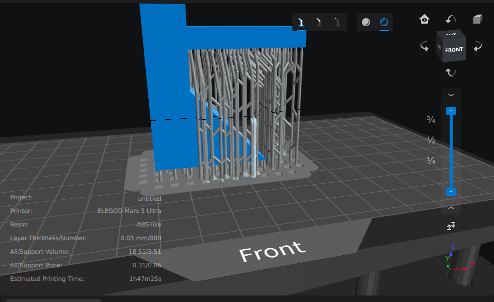

# CHITUBOX Light reference (2026-09-24)

CHITUBOX Basic 2.3, ELEGOO Mars 5 Ultra machine profile, support preset **Light**
(`~/.local/share/chitubox2_0/Conf/MachineConfig/ELEGOO/*.cfgx`, `support[0]`), auto support
`+All` at detection accuracy Middle, on `fixtures/shapes/overhang_bracket.stl`. The supported
model was exported as STL and split into its separate shells. CHITUBOX exports each support
primitive as its own shell, not a union.

## Preset values

| Part | Setting | Light |
| --- | --- | --- |
| Top | contact (tip upper) diameter / depth | 0.30 / 0.30 mm |
| Top | tip lower diameter / length | 0.80 / 2.00 mm |
| Middle | pillar diameter / max connect angle | 0.80 mm / 70° |
| Middle | small pillar diameter | 0.40 mm |
| Bottom | model contact diameter / depth | 0.40 / 0.20 mm |
| Raft | shape / thickness / slope | cross grid / 1.0 mm / 30° |
| General | touch tip distance (spacing) / density | 3.0 mm / 50 % |
| Cross | enabled / diameter | yes / 0.8 mm |
| Cross | initial crossing height | 3.0 mm (supports shorter than this get no crosses) |
| Cross | min Z spacing / max XY distance | 2.0 mm / 30 mm |
| Cross | bidirectional | no (single diagonals, not X pairs) |

The binary's help strings define the cross parameters: *"Set the minimum height value of the
added cross structure. Only when the height value of the added support exceeds the set value
will the cross structure be added with the adjacent support"* and *"When the distance between
adjacent supports exceeds this value, the cross structure is not added."*

## Measured on the bracket

- 855 shells in total, including the model and a raft of 1,234 mm³, 1 mm thick.
- About 80 main pillars, 30–35 mm long, effective diameter 0.8 mm. Many lean 15–30° from
  vertical, within the 70° connect angle.
- About 230 cross members at about 45°, effective diameter 0.8 mm (the same as the pillars),
  mostly 1–6 mm long. They join adjacent pillars only, and run from about 3.8 mm up to just below
  the tips, roughly three per pillar.
- Support volume 3.51 ml for a 15.0 ml part.

## What VoxelMill takes from it

The look: thin 0.3–0.4 mm contacts on a short cone, pillars under 1 mm, and cross braces
between neighbouring pillars only, as dense zigzags that start a few millimetres above the
base. VoxelMill keeps its own values where it has a reason to (see `docs/support-presets.md`).
